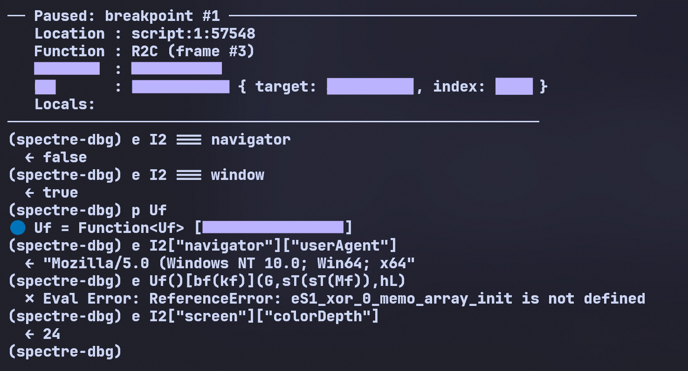

# Unpacking Akamai Bot Manager: VM-in-VM Obfuscation under Out-of-Band Analysis

**Target:** Akamai Bot Manager — XP1M sensor (synchronous payload)  
**Method:** SPECTRE — a deterministic, whitebox JavaScript analysis runtime   
**Focus:** self-integrity checks, the `dvc` environment hash, and backward taint analysis

**Keywords:** Akamai Bot Manager · anti-bot · browser fingerprinting · JavaScript obfuscation · VM-in-VM · virtual-machine bytecode · self-integrity / MurmurHash3 · out-of-band analysis · deterministic execution · record-and-replay · backward taint / provenance slicing · DOM emulation · `dvc` environment hash · sensor decoding

> **Scope & intent.** This is a defensive-security teardown of an anti-bot sensor in Akamai Bot Manager. It focuses on structure and analysis methodology, not bypass techniques. No exploit material or operational details are provided. All tests were conducted on locally captured samples in controlled environments.

---

## Abstract

Akamai Bot Manager protects sites with an obfuscated JavaScript sensor that fingerprints the browser and ships the result to Akamai's edge for scoring. It is a hard target by design: re-obfuscated near-daily, it runs a stack-based **virtual machine inside the JavaScript VM**, packs every constant and API name through a custom float/string codec (zero plaintext), and makes its **own source text tamper-evident** — it hashes that text and uses the hash to key its decoder, so a single reformat or injected byte collapses the script before it runs. Conventional tooling (in-browser automation, in-process hooking, patched DevTools) trips at least one of these defenses. We take the opposite stance: execute the unmodified script in a deterministic, whitebox JavaScript runtime and observe it **from below the language**. We reconstruct the VM, recover the sensor's full structure (envelope → cipher → the `t7C` object, field by field), and — by backward provenance slicing — trace a single divergent fingerprint character to its root cause: an existence probe of `baseURI` and the `Node` constants on a *detached* DOM element. We reproduce a captured sensor to **zero byte differences**, and show it generalises: ten builds over five months reach their synchronous sensor with no code changes, and the design's 2019–2020 ancestors are the same product under an order of magnitude less obfuscation. The contribution is less the dissection of one build than the demonstration that client-side obfuscation, however layered, reduces to an *emulation-fidelity* problem once analysis moves out of band — and that the economic asymmetry of that move favours the analyst.

---

## 1. Introduction: the limits of in-browser analysis

Akamai Bot Manager is one of the most mature anti-automation defenses on the web. On a protected page it injects a heavily obfuscated JavaScript payload that fingerprints the browser, serialises the result into a sensor, ciphers it, and exfiltrates it to Akamai's edge, which scores it and returns the verdict that gates the session.

That payload is **not a fixed target**: Akamai ships a freshly re-obfuscated build, with rotated identifiers and re-encoded data, on a near-daily cadence. The build dissected here is internally named **XP1M** and its sensor object **`t7C`** — but those labels, like every function and field name throughout, belong to *this* build; tomorrow's is renamed wholesale. The names are incidental; the **system** underneath them — the VM-in-VM architecture, the integrity and timing defenses, the fingerprint design — is invariant across builds, and our approach holds regardless of the rotation (§6).

The moment you try to analyse XP1M with the usual tooling — Frida, Puppeteer, a patched DevTools — you lose. XP1M is built to detect instrumentation, and it does so on three fronts:

1. **Self-integrity, and worse — self-*reference*.** The script does not merely *checksum* itself; a hash of its own source *keys its decoder*, so editing it — or even pretty-printing it — makes the decode collapse before anything runs. (Full mechanism in §2.5.)
2. **Timing.** It measures the wall-clock cost of operations with `Date.now()` / `performance.now()`. A debugger pause or a hooked function shows up as a timing anomaly.
3. **A VM inside the VM.** The real collection logic does not live in the obfuscated JavaScript you can read. It lives in **bytecode** run by a stack-based **mini-VM** that XP1M unpacks at runtime. The script you disassemble is just the loader; the secrets are one interpreter deeper.

Each defense targets a *class* of analysis, and the common toolchains fall into one or another of those classes:

| Capability | In-page DevTools | In-process hooking | Out-of-band execution |
|---|---|---|---|
| Read the live sensor | hard (obfuscated, anti-debug) | medium (hook the serializer) | easy (read it from below) |
| Survive the self-integrity check | no (a breakpoint/patch is a change) | no (injection changes the hash) | **yes** (source is untouched) |
| Neutralise timing tells | no (pauses are observable) | partial | **yes** (clock is a provider) |
| Recover a value's root cause | manual, forward | manual, forward | **automatic, backward** (§5) |
| Carry to the next daily build | low | low | **high** (§6) |

The distinction is not "better tooling" but a different *observation point*: in-page and in-process analysis both live where the script can reach back and feel them. To read the sensor without tripping any of this, you cannot hook the browser — you have to *be* the browser, exactly and deterministically, from the outside.

**The punchline first.** Whether a bot survives Akamai's environment hash comes down not to emulating `window`, `navigator`, or `screen` — the surfaces everyone fortifies — but to implementing **`baseURI` and the `Node` node-type constants on a *detached* `<div>` element**. Get that one prototype detail wrong and the `dvc` token diverges in its last few characters, silently, with no error. We found it by running the unmodified payload and asking, of the single wrong output character, *where did you come from?* — following the answer back through two layers of VM until it bottomed out at `div.baseURI`. The rest of this paper is how that question gets asked, and why the daily rotation that breaks every static tool does not touch it.

This paper walks through the **synchronous** `t7C` sensor: what Akamai actually collects, how the mini-VM builds the critical `dvc` fingerprint, and the element-level probe that betrays an imperfect runtime.

---

## 2. The Target: inside the XP1M virtual machine

### 2.1 The file skeleton (and how to recognise any modern Akamai build)

Strip the obfuscation and every modern Akamai sensor has the same shape: **two top-level IIFEs back to back.**

```js
// IIFE #1 — the polyfill prelude (byte-identical across builds; the first ~377 bytes)
(function(){ if (typeof Array.prototype.entries !== 'function') { Object.defineProperty(/* … */); } }());

// IIFE #2 — the payload proper: opens with a fixed run of init calls, then everything else
(function(){ UF(); PIC(); xWC(); var hl = function(Dd,hc){ return Dd===hc; }; /* … the whole VM … */ }());
```

The tell is the **opening init triplet** of the second IIFE — `UF(); PIC(); xWC();` here — three zero-argument calls that populate the decoder's lookup tables (the memoized "namespace" objects the codec reads from) *before any real code runs*. The identifiers rotate every build (`ZU(); ZEk(); xsk();` in the next one, `rB(); pUN(); VCN();` in another, §6.4), but the **triplet-then-`var`** shape is invariant — the single most reliable way to fingerprint a current-generation Akamai sensor at a glance.

The pattern is also **recursive**: major inner functions repeat it. The VM itself is an ES-class (`new FT()` in §2.5 instantiates a small class whose methods are attached dynamically), and a separate large inner routine in the same build opens with its *own* init triplet — `pD(); Pr(); LA();` — before its body. Initialisers populating hidden tables, nested one level down, is the structural signature of the whole design.

XP1M ships as a single minified file. The outer layer is conventional control-flow-flattened JavaScript whose job is to **reconstruct and drive an interpreter** — Akamai's "V3" mini-VM, which is **stack-based**: an operand stack on the VM object (`this[mB]`), a data/constant array (`n2`), and a dispatch loop that decodes opcodes and routes them to handlers.

A defining trait — and what makes static reading miserable — is that **every primitive operation is funnelled through a single-line generic helper**, so one handler serves thousands of call sites. A few, recovered by following the dispatch:

| Helper | Operation | Site |
|---|---|---|
| `X(a,b)  = a + b`                | `ADD` (string concat / numeric) | `1:322940` |
| `k6(NI)  = NI >> hM`             | arithmetic shift | `1:308154` |
| `jg(...) = a >>> b`              | unsigned shift | `1:213752` |
| `Pq(a,b) = a % b`                | modulo | `1:47030` |
| `B2 = nB.apply(this[p8].J, sj.reverse())` | `CALL` (apply, args reversed off the stack) | `1:318044` |

So per-offset breakpoints land on the *helper definition*, never the logical operation — precisely the point.

### 2.2 The string/float codec

XP1M does not store its constants as plaintext. Numbers (including IEEE-754 doubles) are packed into bit-strings and reassembled by a codec. The decoder (`case O2`) reads **8 bytes** via `value.toString(2).padStart(8,'0')`, concatenates the bits, then splits them into an **11-bit biased exponent** and a **52-bit mantissa**, prepends the implicit leading `1`, and returns `mantissa × 2^(exp-bias)` — a hand-rolled `Float64` reader, no `DataView`, no `Float64Array` (both are conspicuously absent from the script). The constant block that feeds it (`b8=1, SD=2, … Ck=8, d8=9, v6=10, w=12`) encodes the field widths.

This codec matters because the `dvc` token is built by the **inverse** path: values → bits → a custom alphabet. Reproducing it byte-for-byte means the engine's numerics must be bit-identical to V8 — which, as we will see, they are.

### 2.3 From JSON to ciphertext

The sensor leaves the browser as a **two-step transform**:

```
t7C (JS object)  ──serialize──▶  insertion-ordered string  ──cipher──▶  POST body
```

1. **Serialize.** The collected `t7C` object is flattened to a string in **property insertion order** (this is why faithful engine semantics matter — see §5).
2. **Cipher.** That string is run through a **polyalphabetic substitution cipher over a custom alphabet, keyed by a small LCG** that advances once per character. The LCG's seed is **not** a static constant baked into the script: it is **derived from a per-session value the server plants in the bootstrap/`_abck` cookie**. The seed appears in clear in the envelope (below); given it, the alphabet, and the LCG constants, the transform is invertible — decryption needs the *seed*, not a secret algorithm. (The exact alphabet, LCG constants, and key-derivation are out of scope here.)

The actual wire body is a single `{"sensor_data": "<S>"}`, where `<S>` is one `;`-delimited string — a short clear-text header followed by the ciphertext:

```
<protocol-ver> ; <flags…> ; <seed> ; <ver-hash> ; <seg6> ; <cipher( serialized t7C )>
```

So the envelope is **self-describing**: the seed the body was enciphered with travels *in the clear* right next to the ciphertext (the backend needs it to decrypt). That alone collapses the cipher to a formality once its (fixed) substitution-over-alphabet is understood — the secret was never the algorithm, only the per-session seed.

And the payload tells on itself. When the `_abck` cookie is absent (a cold first load, or an out-of-band run), the key-derivation **fails, the script catches it, falls back to a baked sentinel seed, and records the failure inside the sensor** as a field literally reading `Error extracting obfuscation keys.` — a built-in confession that the cipher key is degraded. The same condition surfaces in three places at once — the cleartext seed field, that error field, and the missing cookie — the kind of internal cross-check the engine makes trivial to line up.

This cipher is only the outer envelope Akamai's backend peels off; it is **not** where the fingerprint lives, and **not** the integrity check (that is the MurmurHash of §1).

### 2.4 Reconstructing a handler from execution

Reading the dispatch statically is hopeless — but the engine *runs* the dispatch, and every step (opcode fetch, stack push/pop, helper call, register write) is observable from below. Replaying one iteration of the loop and annotating each observed effect turns the generic dispatcher back into a legible handler. Below is the `CALL` opcode (helper `B2`) as reconstructed from a single traced iteration — values and offsets are what the engine actually saw, the structure and comments are the recovered semantics:

```c
// V3 mini-VM — reconstructed CALL handler  (opcode decoded from n2[pc])
void V3VM::op_CALL() {
  @1:318044  argc      = pop(mB);                       // operand stack this[mB] → 3
  @1:318044  fn        = this[p8].J;                    // callee resolved from frame slot
  @1:318044  args      = pop_n(mB, argc).reverse();     // args were pushed in reverse
  /* --- the call itself: String.fromCharCode(0x66) for this site --- */
  @1:318044  ret       = fn.apply(this[p8].J, args);    // → 'f'
  @1:32736   push(mB, ret);                             // result back on operand stack
             pc       += n2[pc].size;                   // advance to next opcode
}
```

The same treatment applied to the arithmetic helpers (`X`/`k6`/`jg`/`Pq`, §8.1) and the float codec (`case O2`) reproduces the whole opcode set as a handful of small, named routines — recovered not by guessing from the minified source, but by *watching the source run* and writing down what each generic one-liner does at each site. Once the dispatcher is reconstructed, a value's history (§3.1) reads as ordinary code, not VM noise.

### 2.5 The decoder is keyed to a hash of the script's own text

XP1M does not merely *checksum* its source — it **reads its own text back via `Function.prototype.toString()` and lets a hash of that text drive its decoder.** One inner function (~30 KB of the file) is `toString()`-ed, a **MurmurHash3** is taken over a ~30 KB slice of it, and that hash seeds the string/number codec that reconstructs every obfuscated name and constant. Reformat or edit that function and the hash changes; the codec then produces the *wrong* strings — and since some of those strings are used as **method selectors**, the next call is to a non-existent method.

The failure has a precise epicentre. The script first assembles the **host object** `SAC` — the fingerprint surface, `{Math, document, window, String, parseInt}` (the live globals every probe reads through) — then does:

```js
var lhC = new FT();                         // a VM instance whose methods are keyed by decoded handles
lhC[ Tl()[Gb(c1)](T0, bG, t5) ](SAC, …);    // ← the method selector is *decoded*, not a literal name
```

`Tl()[Gb(c1)](…)` is meant to decode to a key that selects a real method on the VM instance `lhC` (in a live capture, `lhC` is an object whose methods are indexed by decoded handles — `{4: ƒ, 9: ƒ, 17: ƒ, …}`). Once the hash is off, the codec returns the wrong handle, `lhC[<wrong>]` is `undefined`, and the call throws — the real browser's `Uncaught TypeError: lhC[Tl(…)[Gb(…)](…)] is not a function` (at `…:6097`), our engine's `TypeError: Method Call expected Function, got Primitive`. This is the **first place a corrupted decode is consumed as a *method selector* rather than a data value**, so it is where the silent desync becomes a hard throw.

This is browser-confirmed: pretty-printing the file and loading it in a stock browser yields exactly that `lhC[…] is not a function`. The lesson is absolute — **you cannot beautify-and-run, and you cannot edit the hashed function to instrument it**. The only faithful way to observe the script is to run its **exact original bytes** and watch from underneath, which is what §3 does.

> **Take-away.** XP1M is a loader for a stack-based VM with generic one-liner handlers, float-codec-packed constants, and a decoder **seeded by a self-`toString()` hash**. None of these defeat *execution* — they defeat *modification* and *observation*. The analysis must change neither.

---

## 3. The Methodology: deterministic whitebox execution

The bet behind **SPECTRE** is simple: don't hook a browser, **build a transparent one** — a deterministic, whitebox JavaScript engine that runs the *unmodified* script while presenting itself as a specific real browser (here, a local Brave on Windows). How it is built is not the point; what it can *do* to the target is. From below the language, without touching a byte of the script, it gives the analyst four capabilities:

```
   unmodified Akamai build ─▶ [ deterministic whitebox engine ] ─▶ decoded sensor + root cause

     · backward provenance slice — ask "where did this value come from?"      §3.1
     · deterministic replay      — freeze/replay clock · random · cookie       §3.3
     · out-of-band hooks         — on_leave / intercept any routine (Python)   §3.2
     · live key decode           — resolve obfuscated computed keys at runtime  §3.4
```

This approach neutralises all three of XP1M's defenses at once, **without touching the script**:

- **Integrity passes for free** — the engine runs the *unmodified* source, so the self-reference of §2.5 verifies a pristine script, because it *is* pristine. Instrumentation lives below the language: no AST rewrite, no patched `toString`, no extra frame.
- **Timing is frozen** — `Date.now()`, `performance.now()` and the event-loop clock are swappable providers; pause for ten minutes and the script still sees a few milliseconds elapse. Timing attacks measure a simulated reality.
- **The VM is fully observable** — every operand-stack slot, heap object, and property access is readable, but only from below, where the script cannot look.

Achieving full **byte-exactness** against captured Brave sensors required strict ECMAScript conformance (notably preserving property **insertion order** through serialisation, and omitting — not nulling — `undefined`-valued properties as the JSON spec mandates). Those are engine-correctness details; once satisfied, they get out of the way and let the *real* fingerprinting logic stand alone. That is the entire purpose of byte-exactness here: it is the noise floor that makes a one-character divergence in a fingerprint token *meaningful*.

**Where this sits in the tooling landscape.** For *native* code, dynamic binary instrumentation and symbolic execution are mature — PIN and DynamoRIO for DBI, Triton and angr for taint and symbolic reasoning — and VM-based native obfuscation has been studied with exactly these tools. Client-side *web* defenses, by contrast, have largely been met with high-level browser automation (Puppeteer, Playwright) or coarse in-process patching (a `Frida`-class hook) — neither of which survives a self-checksum or offers value-level data-flow. The approach here brings native-grade **taint and value-level provenance tracking to the JavaScript-VM layer**; that tooling gap is a large part of why VM-in-VM web obfuscation has stayed effective for so long.

### 3.1 Backward provenance slicing

Forward-reading a stack VM's dispatch loop is hopeless — every value passes through the same five helpers. So the engine records a **provenance graph** instead. Each time a value is written, it appends an immutable node capturing:

```
node {
    id          # unique id of this value
    parents     # the operand nodes it was computed from, at that moment
    op          # the operation that produced it (Add, GetProp, Call, IterNext, …)
    col         # the source column responsible
    value       # a compact fingerprint of the value
}
```

Versioning is per-call-frame (loops and reused values stay distinct), and heap indirection — the VM's operand stack and data arrays — is bridged by a `(address, slot)` side table, so a value can be followed across a heap round-trip and across call boundaries (arguments are linked to the callee's parameters). A **backward slice** from any node rebuilds the exact computation DAG that produced it, *through* the obfuscation rather than around it. This is what turned "this fingerprint byte is wrong" into "this byte came from *that* probe on *that* object." We use it next.

### 3.2 The analyst interface: out-of-band instrumentation

A whitebox engine is only as useful as its driver. Standard dynamic instrumentation relies on **in-process hooks** — attach, hook, read arguments — but against XP1M that loses on contact: injecting *anything* into the page changes the script's MurmurHash and poisons the session.

The analysis is driven through a **Python binding** over the engine's interception and replay primitives. Because the engine *owns* the VM, hooks attach to **function addresses** (resolved by name), not to patched source — the script's bytes are never touched, so its self-checksum stays valid. The shape is a familiar `onLeave` callback on a target routine, except the callback is **pure Python** and the target is a function *inside the obfuscated VM*:

```python
import spectre

eng = spectre.Engine(profile="akamai_brave")
eng.set_html("<body><div id='target'></div><input id='textbox'></body>")
eng.enable_replay("./capture.json")          # frozen Date.now / Math.random / cookie

eng.run_file("…/XP1M.js")                     # load + run the target

# onLeave with a Python handler: when the VM routine that produces the (ciphered)
# payload returns, we receive its return value in Python — to decode, or replace.
addr = eng.function_entry("…")               # resolve a routine's address by name
eng.on_leave(addr, lambda payload: decode_compare(payload))

eng.run_event_loop()                          # emits the synchronous sensor
```

A minimal end-to-end run — a JS routine `cipher(x)` invoked asynchronously, hooked from Python — prints:

```
[onLeave] cipher returned: 'ENC(payload-42)'      # the JS return value, in Python
```

and the same machinery drives the full XP1M run to its sensor:

```
🔗 XHR Open: POST …/XP1M.js
🚨 EXFILTRATION #1  seg6 = 31,0,0,1,2,0           ← reproduced sync sensor, from Python
```

And the **plaintext payload itself** is one call away — `last_sensor()` returns the serialised `t7C` the script built right before ciphering it:

```python
>>> print(eng.last_sensor()[:480])
{"ver":"…","fpt":";-1;dis;;true;true;true;0;true;24;24;true;false;-1","fpc":"4290",
 "ajr":"1,109537|109537",
 "din":[{"wow":1440},{"asw":1440},{"nps":"20030107"},…,
        {"ran":"0.14656732773"},
        {"adp":"cpen:0,…,wrc:1,…,vib:1,bat:1,x11:0,x12:1"},
        {"ua":"Mozilla/5.0 (Windows NT 10.0; Win64; x64) … Chrome/149.0.0.0 Safari/537.36"}],
 "eem":"do_en,dm_en,t_en", …}
```

That is real Akamai sensor data — the `din` capability probes (note `wrc:1`, WebRTC present), the spoofed geometry, the UA — pulled out of the running VM from Python, before a single byte is enciphered.

Two sharp edges sit behind this:

- **`on_leave(addr, py_fn)`** — a Python callable fires when a VM routine returns, receives the return value (JS→Python), and may **replace** it (Python→JS) — the move for "grab the payload the cipher produced, decode it offline."
- **`intercept_replace_js(addr, src)`** — swap a function inside the VM for arbitrary JavaScript, out of band.

Both attach to **resolved addresses**, never to patched source. Combined with the frozen clock and the backward provenance slicer of §3.1, this is the method: *execute the target faithfully, instrument it out of band, and ask the engine where any value came from.*

> Serialising a full run to an offline trace (a `.ghost` file) so the slicer can run *after* execution — time-travel analysis — is the intended primary workflow.

### 3.3 Determinism beyond linear code: the event loop

A synchronous sensor is the easy half. The reason emulators usually die later is the **event loop**: Akamai's collection is sprinkled with `setTimeout`, `Promise` microtasks, and `requestAnimationFrame`-style deferrals, and a fingerprint like `seg6` is literally a vector of `Date.now()` *deltas measured across those deferred phases*. An engine that runs JavaScript but fakes time loses here twice — the interleaving order is wrong, and the deltas are wrong.

Determinism has to extend to the scheduler. The clock is not merely frozen; it is **driven by the loop**. The model is standard microtask/macrotask separation, but virtual time only advances when the loop chooses to: drain all microtasks at the current instant, then **jump the virtual clock forward to the next due timer deadline** and fire it. A callback scheduled at `+5ms` and one at `+50ms` execute in the right order, with exactly `45ms` of *simulated* time between them — independent of how long the analysis actually paused. So `seg6`'s deltas are a function of the *schedule*, not of wall-clock reality, and reproduce byte-for-byte. This is what lets the same methodology carry into the asynchronous sensor (Part 2): the interleaving that breaks naive emulators is, here, just another deterministic input.

---

### 3.4 Reading obfuscated property keys, live

Almost every value in the sensor is produced by reading a **computed** property off a global — `host[obj][prop]` where `obj` and `prop` are *not* string literals but expressions decoded at runtime from the build's packed constant table. Statically, you see `I2[Tl()[Gb(bx)](…)][Vh()[xf(mq)](…)]` and learn nothing. The script, however, must compute the real key to do the lookup — and the engine watches it do so, from below.

Take the global object. Everything the sensor reads — `navigator`, `screen`, `document` — it reaches through an alias `I2`, established by the very first init call (`UF()`, §2.1):

```js
function UF() {
  if (typeof window !== "undefined") I2 = window;        // obfuscated as: typeof window !== ([] + [][[]])
  else if (typeof global !== "undefined") I2 = global;
  else I2 = this;
}
```

So `I2` is just the global object — in a browser, `window`. The engine confirms it from below, live, and then reads the real fingerprint values straight through it:



*Figure 1 — Paused inside the fingerprint builder. `I2 === window` returns **true** (and `I2 === navigator` false), confirming the alias; the engine then reads the actual spoofed values through it — `I2["navigator"]["userAgent"] → "Mozilla/5.0 …"`, `I2["screen"]["colorDepth"] → 24`. (One decoder returns a `ReferenceError`: some of the build's string-decoders are stateful cursors that only resolve at their original access site, not on demand — the engine reads those from the access site instead.)*

An obfuscated alias and its computed-key probes, resolved one by one from a live execution, with the real values read straight after. The packed encoding that defeats `grep` is just a function the script runs — and anything the script runs, the engine can read the inputs and outputs of.

---

## 4. Unpacking the `t7C` sensor

`t7C` is a flat dictionary of ~80–90 fields assembled by a generic builder (`t7C[k] = source[k]`). Capturing real Brave sensors through a proxy and diffing them against the engine's dump reveals their nature. Critically, comparing **multiple Brave runs to each other** shows ~35 of ~97 fields vary per session (entropy/timing); the other ~62 are stable and can be matched exactly.

| Group | Field(s) | What Akamai learns |
|---|---|---|
| **Identity** | UA, version, appVersion | browser/engine claim |
| **Geometry** | inner/outer W·H, screen W·H, avail* | display + OS scaling (e.g. 1920×1080 @133% → 1440×810) |
| **Capability** | `din.adp` → `…,wrc:1,…` | feature presence (WebRTC `RTCPeerConnection`, …) |
| **Timing** | `seg6` | `Date.now()` **deltas** between collection stages — a VM/instrumentation tell |
| **Interaction** | `sde` | event counters (mouse/key) |
| **Fingerprint** | `mst.dvc` | a hash of the browser's API surface + per-session entropy |

Two are worth pausing on. **`seg6`** is not an event count — it is a vector of `Date.now()` deltas measuring how long each collection phase took. On an instrumented or slow runtime those deltas balloon; Akamai reads them as a liveness/speed signal. (Under the engine's frozen clock they are deterministic and reproduce exactly.) And **`din.adp`** carries capability bits like `wrc` (WebRTC) — a single absent constructor flips the bit and marks the session.

But the field that took the longest to crack, and reveals the most about how Akamai thinks, is `mst.dvc`.

---

## 5. Reversing the `dvc` token: an API-surface hash

`mst.dvc` has the grammar:

```
dvc          := token "," count "," permutation
token        := 20 × base31 over the alphabet "a3cd9efghiYjklm7opqrs1uvwQxyBz2"
count        := number of permission queries performed   (e.g. 9)
permutation  := completion order of async probes         (e.g. "f+c+b+a+k+g+i+e+h+j+")
```

The decisive early observation: **`dvc` changes between two runs of the same Chrome build.** Chrome has no farbling, so this is not Brave's per-session canvas noise — it is intrinsic per-session entropy *combined with a deterministic signature*. That means it is reproducible given the same entropy, and any residual divergence is a real fidelity gap, not randomness.

Replaying Brave's captured `Date.now()`/`Math.random()` sequences into the engine, the token matched on **count**, **permutation**, and **14 of its 20 characters**. Six characters of the tail stayed wrong. The 14/6 split was rock-stable across captures — structural, not stochastic.

### 5.1 The slice in action

We armed the provenance recorder on the final tail character and dumped its backward slice. The recorder crosses every obfuscation boundary and bottoms out at the source:

```
#48211 Call ='f'(code 102) @1:32736        String.fromCharCode(code)
  #48207 Add =113.0          @1:228360      cumulative sum:  jAC += hdC[PTC]
    #48190 GetProp =8.0       @1:226401      hdC = rlC[fNC[..]]   (delta table)
      #47980 IterNext         @1:222709      serializer VNC(nfC, BAC)
        #47611 Mul =306140.0  @1:160969      AU *= dW             ← feature-probe hash
          #47604 StrictEq =false @1:160931    host[Class][Method] === undefined
            #47590 GetProp =undefined @1:160904  the probed property
    #48189 GetProp           @1:224033      seed: PNC - HT[HT.length-1]
```

The tail is not a number, not canvas, not a float-codec artefact (all of which we chased and ruled out — the engine's numerics are bit-identical to V8, proven against the head of the very same token). The tail is a **multiplicative hash of API-existence checks**, serialised through a cumulative-sum delta decoder: `token[k] = seed + Σ deltas[0..k]`, where the deltas come from a running product `AU` of `host[Class][Method] === undefined` probes.

Every probe we could decode matched Brave — the absent automation markers (`$cdc_…`), the permissions, the present sensors. Decoded factors all matched, yet the tail diverged. The dynamic trace could not resolve the contradiction. The VM was hiding the divergent probe in a code path that a single run did not exercise the same way.

The whole investigation collapses into one picture — *start from the one wrong character, walk backwards, arrive at the root cause*:

```
  [!] Divergent dvc tail character  (engine emits the wrong glyph)
                           │
                 (backward provenance slice)
                           │
             ┌─────────────┴─────────────┐
             ▼                           ▼
      cumulative sum (AU)          delta table (hdC)
             │                           │
             └─────────────┬─────────────┘
                           ▼
            feature-probe hash multiplier (dW)
                           │
                           ▼
            host[Class][Method] === undefined
                           │
                           ▼
       [★] root cause:  div.baseURI === undefined
                           │
        (engine fix: implement HTMLElement.baseURI getter
                       + the Node node-type constants)
                           │
                           ▼
                  [✓] 0 diffs — 20/20 match
```
*Figure 2 — Backward provenance slice from a single divergent fingerprint character to its DOM-prototype root cause. This is the inversion that forward tracing cannot do: causes are upstream, and the slice walks straight to them.*

### 5.2 What Akamai actually does

A decompiled copy of the V3 VM resolved it. To build `dvc`, Akamai does **not** simply read the global `window`. It **instantiates a detached DOM element and hashes the existence of specific properties on that exact element**:

```javascript
var div = document.createElement("div");
var marker = 0;

//        property present on the element?      yes  : no
marker += (div.getElementsByTagName !== undefined) ?  35 : 531;
marker += (div.ATTRIBUTE_NODE       !== undefined) ?  -1 :  99;   // Node node-type constant
marker += (div.baseURI              !== undefined) ? 2+r : 27;    // standard Node property

AU *= marker;          // folded into the multiplicative hash
// … AU → delta table → cumulative sum → base31 token tail
```

The probe targets an **element**, not the document. A runtime whose `HTMLElement.prototype` is missing `baseURI` or the twelve `Node` node-type constants (`ELEMENT_NODE=1` … `NOTATION_NODE=12`) returns `undefined` for `div.baseURI` / `div.ATTRIBUTE_NODE`, takes the wrong branch, and the cumulative sum diverges — silently corrupting the base31 tail, no crash, just a token the backend flags. That is the perfidy: it does not test capabilities you would think to emulate (`navigator`, `screen`) but **prototype-level minutiae of a throwaway element** — exactly what a headless browser or an imperfect hook forgets. Adding `document.baseURI` did nothing, because the probe is `div.baseURI`; only reading Akamai's own VM showed it was an *element* probe.

Completing the engine's `HTMLElement.prototype` with `baseURI` (a `this`-independent getter resolving to the document URL) and the `Node` constants drove the probe to the genuine-browser branch. The base31 alphabet `"a3cd9efghiYjklm7opqrs1uvwQxyBz2"` recovered from the same decompile also explains the otherwise-baffling `Q`/`B`/`Y`/`z` glyphs in the token.

This element-probe is not specific to the build studied here: an independent static decompilation of an unrelated Akamai deployment recovers the same routine — a created `div`, the same existence checks, the same base31 alphabet, and a DJB2 hash — which is strong evidence that the probe is intended design rather than an artefact of one capture.[^dvc-corrob]

[^dvc-corrob]: *Akamai-VM*, a public static decompiler of Akamai's stack-based VM (different site, published May 2026). Its lifted output reproduces the `dvc` generator independently of this work: `document.createElement("div")`, the `getElementsByTagName` / `ATTRIBUTE_NODE` / `baseURI` existence checks, the alphabet `"a3cd9efghiYjklm7opqrs1uvwQxyBz2"`, and the hash `h = 5381; h = h*33 ^ charCodeAt(i)`. Two analyses by different authors — one static (their lift), one dynamic (the execution here) — converging on the same construction is the cross-check.

### 5.3 Result, quantified

The fix is a single character in a single token, so the measurement that matters is whether *every other* field already matched — otherwise a lone corrected character proves nothing. It did. Diffing the engine's serialised `t7C` against a proxied live Brave capture, field by field (flattening the `din`/`mst`/`fwd` singleton-object arrays):

| Metric | Before the `div.baseURI` fix | After |
|---|---|---|
| `dvc` token characters matching (of 20) | **14 / 20** | **20 / 20** |
| `dvc` `count` + `permutation` | match | match |
| Deterministic `t7C` fields matching (~62 of ~97) | all but `dvc` | **all** |
| `t7C` total field diffs | **1** (`mst.dvc`) | **0** |
| Residual entropy (the ~35 per-session fields) | reproduced under replay | reproduced under replay |

The diff that mattered, reduced to its essence:

```diff
  "fpc":"4290", "ajr":"1,109537|109537", "din":[ … 62 fields identical … ],
- "mst":{ … "dvc":"……………Qx5z2,9,f+c+b+a+k+g+i+e+h+j+" }   # tail 6 chars wrong, no error
+ "mst":{ … "dvc":"……………<exact>,9,f+c+b+a+k+g+i+e+h+j+" }   # 20/20, diffs = 0
```

**Every deterministic field, including the full `dvc` tail, byte-identical to Brave; total diffs `0`.** That zero is the load-bearing number: the noise floor that made the *one* surviving character meaningful, and the proof that the divergence was `div.baseURI` and nothing else. `dvc` was the *last* residual — it fell only after earlier corrections (property insertion order, JSON `undefined`-omission, display geometry, WebRTC presence, the voice list behind `ssh`, capped `deviceMemory`). A redacted, checksum-level **reproduction receipt** — including a byte-identical match of the integrity-hashed function — is in **§8.4**.

---

## 6. Cross-Version Generality: a moving target

Everything above describes *one* file. But Akamai does not ship one file — it ships a **freshly re-obfuscated build, typically every day**. If the analysis only worked on the one snapshot, it would be a curiosity, not a capability. So the real question is: *what does the engine have to re-do for tomorrow's build?*

### 6.1 What rotates, and what doesn't

I compared two snapshots a few days apart (call them **A** and **B**). The result is a clean separation between the **costume** and the **body**.

**Rotates every build (defeats all static analysis):**
- **Every identifier** is renamed. A textual diff of the two files diverges at byte ~378 (right after the shared prelude) and never re-aligns — a `diff` is pure noise, and any byte-signature/YARA rule dies on the next drop.
- **The string and number tables are re-encoded.** In *both* files there is **zero plaintext**: the base alphabet, the integrity constants, even API names like `createElement` / `WeakMap` / `RTCPeerConnection` appear **nowhere** as literals — they are all reconstructed at runtime by the float/string codec (§2.2).
- **The integrity hash is keyed to the day's exact source** (§1), so the self-checksum changes with the rotation — and any analyst who *edits* the script to read it breaks that checksum.
- **The cipher key rotates per session** on top of the daily rebuild (§2.3): the cipher's seed is planted in the cookie by the edge, so even two runs of the *same* build encrypt to different bytes.

**Invariant across builds (the body under the costume):**
- The **byte-identical prelude** (the `Array.prototype.entries` polyfill — the first ~377 bytes match exactly) and the same polyfill set.
- The **architecture**: an outer loader unpacking a stack-based mini-VM with the same idioms (a collection array, lazy-memoized accessors, the IIFE shell, generic one-line opcode helpers).
- The **codec** (float/bit packing), the **integrity scheme** (MurmurHash-class over sliced self-source), and the **fingerprint logic** (existence probes hashed into a token, §4) — same mechanisms, re-keyed.

Build B was ~57% larger than A — but the growth was disproportionately **numeric data (+78%)** and **array literals (+62%)** versus functions (+44%): a *bigger VM program and more probes*, not a new design.

### 6.2 Why daily rotation is a no-op for out-of-band execution

Rotation is engineered to defeat the two things a classic analyst does: **read** the script (broken by encoding + per-day renaming) and **modify** it to instrument (broken by the self-checksum). The out-of-band approach does neither — it *executes* the file verbatim, and the encoded tables **decode themselves at runtime**, as they must. The rotation that annihilates a signature is invisible to it: the same interpreter runs build A, build B, and tomorrow's build unchanged.

What *can* still cost something per build is **web-platform completeness**: a newer build may probe an API the engine implements imperfectly — the same class as the `div.baseURI` fix in §5. The honest measure of "how generic is this?" is therefore: *how much completeness work does a fresh build need?*

### 6.3 Case study: bringing up build B from cold

I pointed the engine at build B (a few days newer, +57% code) with **no code changes** and let it run. It cleared the bootstrap and reached deep into collection, then stopped at exactly **three** completeness gaps — each localised in a single trace, none requiring me to reverse the VM:

1. A **`window.history`** probe (`history.pushState`) — the build fingerprints the History API; the engine lacked it. Added the object.
2. A hidden **`new WeakMap()`** — the engine had a `WeakMap` implementation that had simply never been wired into the global environment. Wired it.
3. (A stale internal debug assertion, unrelated to the target, removed.)

The `WeakMap` case is the instructive one, because it shows the **whitebox-vs-whitebox** method that makes this fast. The failure surfaced not as `new WeakMap()` — the constructor name is encoded — but as a dereference of `undefined` deep inside the VM. The trace reconstructed the *exact source column*; the obfuscated expression there was `new (KL[ W7()[…].apply(…) ])()`, where `W7()` is an **array iterator the script has hijacked as a memoization cache**. Setting one breakpoint **in real Brave** and evaluating the same (browser-independent) decoder expressions revealed the resolved string: `'WeakMap'`. Engine-side fix, done. After the three fixes, build B emits its synchronous sensor.

The per-build cost, made concrete: **not reverse-engineering but occasional web-platform completeness — minutes, not days, and increasingly automatable.** The *mechanism* (codec, cipher shape, fingerprint logic) is reversed once and carries forward, because it is the invariant.

### 6.4 Measured across a build family

Two builds is an anecdote. To test the claim, the same engine — **unmodified** — was pointed at a family of builds collected over **161 days**: the reference (XP1M, June) plus nine newer builds captured across November. The structural invariants hold across all ten:

- **Prelude:** the longest common prefix across all ten is exactly **377 bytes** (the `Array.prototype.entries` polyfill), diverging at byte 378.
- **Identifier rotation:** from byte 378 on, every name is rotated. The three bootstrap calls, build by build: `UF();PIC();xWC()` · `ZU();ZEk();xsk()` · `rB();pUN();VCN()` · `Dz();OO5();zr5()` … same *shape* (`init();init();init();var X=function…`), no shared *names*.
- **Zero plaintext:** `createElement`, `WeakMap`, `RTCPeerConnection`, `getElementsByTagName`, `baseURI`, `ATTRIBUTE_NODE`, `webdriver`, `documentElement` appear **0×** as literals in every build; only `navigator` leaks (4× each).
- **Growth, not redesign:** 732 functions / 339 KB (June) → ~900–977 functions / ~480–526 KB (November). A bigger VM program, the same VM.

On the **execution** test, in one line: **tested on this family of ten builds over five months, the engine reached the synchronous POST every time, and the nine builds newer than the reference needed zero code changes and hit zero blocking gaps** — mean per-build cost: 0 platform features, 0 VM re-analysis. The one-time completeness work an *earlier* build forced (§6.3's `WeakMap`/`window.history`) is already in the engine, so the family runs free.

The *spectrum* of outcomes is the honest summary — from full byte-exact, to "runs free", to a genuinely different lineage that does not:

| Build | Era | Size | Outcome |
|---|---|---|---|
| XP1M (reference) | Jun | ~339 KB | **byte-exact** sensor (diffs = 0) under replay |
| Build B (newer) | Jun (+days) | ~532 KB | sensor emitted — **3** one-time completeness fixes |
| Nov family (×9) | Nov (+5 mo) | ~480–526 KB | sensor emitted — **0** changes, 0 blocking gaps |
| separate lineage | — | ~392 KB | **halts** on its own loader — its own bring-up (out of scope) |

The cost *curve* is the story: 3 fixes for an early build, byte-exact on the reference once those landed, then 0 across the following five months. The work is front-loaded and amortising — each fixed gap is fixed for all future builds, while Akamai pays the full re-obfuscation cost every day (the economics: §7.1).

Two honesty notes (expanded in §7.3): "reaches the synchronous POST" means a *structurally valid* sensor — byte-exactness (diffs `= 0`) was confirmed only on the reference build, which needs a per-session capture replayed per build; and this is *one* lineage — a genuinely different generation (different prelude, different bootstrap idiom) halts on its own loader and needs its own bring-up. The claim is "rotation within a design is a no-op," not "all obfuscation is solved."

### 6.5 The longer arc: from a readable script to a self-hashing VM

Daily rotation is the short timescale. The *interesting* timescale is years. Akamai Bot Manager did not start as the VM-in-VM monster dissected here. Earlier generations — versions **1.67 / 1.68 / 1.7** (circa 2019–2020) — are a different animal entirely:

| | Akamai ~1.7 (≈2019–2020) | Modern (XP1M, 2024–2025) |
|---|---|---|
| Size | ~58–62 KB | ~340 KB (≈6×) |
| Structure | linear, readable; **one** `switch` | stack-based VM, thousands of opcodes |
| Obfuscation | minified only | float-codec-packed, **zero plaintext** |
| Field names | **in clear** — `bmak.kact`, `bmak.ke_cnt`, `bmak.mme_cnt`, `bmak.start_ts` | rotated 2–3-char codes, decoded at runtime |
| Integrity | none of note | self-`toString()` hash seeds the decoder (§2.5) |
| Config | a readable `bmak = { ver: 1.7, ke_cnt_lmt: 150, … }` object | reconstructed from packed data |

The 1.7-era script wears its telemetry on its sleeve: `bmak.kact` / `ke_cnt` / `ke_vel` (keyboard activity, count, velocity), `mme_cnt` (mouse-move events), `pme_cnt` (pointer), `start_ts`, all assembled into `sensor_data` you can read by scrolling. No VM, no codec, no self-hash. It is the *same product* — same `bmak`/`_cf` globals, same behavioural-telemetry concepts, same `sensor_data` POST — wrapped in an obfuscation budget that has grown by roughly an order of magnitude.

That arc is the real argument for the methodology. Over five years Akamai escalated from "readable if you squint" to "VM-in-VM with a self-`toString()`-keyed decoder," each step raising the bar for *static reading* and *in-source patching*. **None of those escalations touched execution.** A 1.7 script and an XP1M script run the same way out of band — one is just easier to read afterwards.

*(For the curious: the readable 1.6x/1.7 scripts are genuine period captures, not decompiled VM output — old Akamai simply was that legible before the VM era. They make an excellent Rosetta stone, since the modern packed fields map back to these named ancestors.)*

---

## 7. Conclusion

What this paper demonstrates is bounded and concrete: the **synchronous XP1M collection pipeline** — its stack-based VM, float/string codec, self-`toString()` integrity scheme, `t7C` sensor and `dvc` fingerprint — was understood and reproduced byte-for-byte, and the result held across a family of builds. That is *not* "Akamai Bot Manager was defeated"; it is one stage of one product, read end to end. Against in-browser tooling that stage wins, because every defense it deploys targets an analyst who **modifies** or **observes from inside** the sandbox — and shifting analysis **out of band** removes that threat model (§7.2).

The transferable result is the **method**, not the target. The headline is not "Akamai probes `div.baseURI`" — it is that one can take a **single wrong character in a final, ciphered token and walk it backward, automatically, through two layers of obfuscated VM to its root cause** in the DOM. `div.baseURI` is merely the proof of that capability. A signal built to punish inexact browsers, reproduced exactly, becomes a precise *specification* of what the target measures.

Stated plainly: **client-side obfuscation does not prevent analysis — it converts it into a problem of emulation fidelity**, which is bounded, measurable engineering rather than an impasse. What remains — the asynchronous sensor, canvas, behavioural telemetry, server-side scoring — is that same fidelity frontier, and the subject of Part 2 (§7.4).

### 7.1 The reverse-engineering cost — an economic asymmetry

The bulk of the work was **not** decoding any single build — it was building a runtime faithful enough that an unmodified Akamai script cannot tell it from Brave: the JS engine, the DOM, the platform providers, the integrity-hash and float-codec re-implementations, the provenance recorder. That is the multi-month, one-time investment, amortised across every build and every Akamai-protected site.

Against that baseline, the *per-target* and *per-build* costs are small and asymmetric:

- **Reconstructing the mechanism once** (the codec, the cipher shape, the `dvc` probe design) was a matter of days, and most of it was spent on the last few characters of one token (§5) — the rest fell out of the trace.
- **Bringing up a fresh daily build** (§6.3) cost **three localised completeness fixes**, none of which required reverse-engineering the VM — hours, not days.

For the client-side JavaScript layer, the economics invert: Akamai pays a re-obfuscation cost *every day* to invalidate static analysis of that layer, while an out-of-band analyst pays *once* for the mechanism, then a near-constant trickle for platform completeness. On that axis alone the defender is on the wrong side of the curve — a deliberately narrow claim that says nothing about the *other* axes Akamai scores on (§7.2), where the real contest has moved.

### 7.2 The limits of the design

The defenses are formidable against the threat model they assume — and inert against the one used here. Not worthless, then; the question is *where* they bind.

- **Self-integrity and anti-tamper protect the script from modification, not from observation.** A checksum proves the code is pristine; it cannot tell whether the *runtime underneath it* is real. An engine that never edits a byte satisfies every integrity check by construction.
- **Timing defenses assume a clock the analyst does not control.** When the clock is a provider, the wall-cost of inspection is unobservable to the script.
- **VM-in-VM obfuscation raises the cost of *reading*, not of *running*.** The bytecode still has to execute; an instrumented interpreter watches it execute regardless of how many layers wrap it.
- **Daily rotation defeats signatures, not semantics.** Because the structure (collection → serialize → cipher), the field taxonomy, and the probe design are invariant, the *extraction* of the payload and of its key structural elements can be **automated and carried across rebuilds** — the rotation changes names, not meaning. Re-deriving the structure of a new build is, in principle, a re-run plus a diff, not a fresh reverse.

The strategic implication, stated carefully: **client-side obfuscation raises the analyst's *cost* but does not by itself change the *outcome*** of recovering the sensor — the client must ultimately execute the logic in an environment the analyst controls. That is *not* "client-side defense is dead": Akamai is not only the JavaScript payload this paper dissects. A mature deployment correlates the sensor with signals that an out-of-band JS engine does **not** by itself reproduce:

- **Transport fingerprints** — TLS ClientHello (JA3 / JA4) and HTTP/2 frame ordering, which must match the impersonated browser, not the tool emitting the request.
- **Network-stack fingerprints** — TCP/IP characteristics (window sizes, options) below the application layer entirely.
- **IP / ASN reputation and history**, request cadence, and cross-request behavioural correlation server-side.
- **Behavioural scoring** of the *asynchronous* telemetry (mouse, keystroke, scroll dynamics) — believable human interaction, not just a structurally valid sensor.

A byte-perfect `t7C` is necessary but not sufficient against that stack. The honest conclusion is narrower and more durable than a bypass claim: **the frontier of anti-bot has already moved off client-side JavaScript obfuscation** — which deterministic out-of-band analysis reduces to a fidelity problem — **and onto signals that are expensive or impossible to reproduce away from a real browser on a real network.** Defenders who over-invest in JS obfuscation, and attackers who think a valid sensor is the whole game, are both fighting the last war.

### 7.3 Threats to validity, and where the approach breaks

The result is bounded, and the boundaries matter as much as the claim.

- **Byte-exact was proven on one build; generality was proven *structurally*.** The reference build matches a live capture to `0` diffs. The nine-build family study (§6.4) proves the engine *runs* each newer build to a structurally valid synchronous POST with no changes — it does **not** assert each is byte-exact, since that requires a per-session capture (cookie/clock/entropy) replayed per build, done only for the reference.
- **One family, not all of Akamai.** §6.4 holds *within a build lineage*. A genuinely different generation — different prelude, different bootstrap idiom — does not run for free; in testing, a build from a separate lineage halted on its own loader and would need its own bring-up. "Daily rotation is a no-op" is a claim about rotation *within a design*, not about every variant Akamai has ever shipped.
- **Synchronous sensor only.** The behavioural, interaction-driven asynchronous sensor is out of scope here (Part 2). It is the harder half precisely because faithful *interaction* is not free the way faithful *execution* is.
- **Platform-completeness has limits.** The per-build cost trends to zero *for surfaces the engine implements*. Surfaces it does not yet reproduce faithfully — `WebGPU`, `AudioWorklet`, `SharedArrayBuffer` timing, real ICE-candidate gathering, GPU-timed effects — are exactly where a future build could reintroduce cost. The approach converts obfuscation into an emulation-fidelity problem; it does not make emulation fidelity infinite.
- **No server-side visibility.** Everything here is client-side. What Akamai's backend *does* with the sensor — the scoring model, the network/TLS/reputation signals it is correlated against — is invisible to this method and unaddressed by it (§7.2).
- **Single environment.** One browser profile (Brave/Windows). Other profiles are a configuration change, not a re-derivation, but they were not exhaustively tested.

The contribution is a *method and its measured envelope*, not a universal bypass.

### 7.4 What's next

This paper intentionally focuses on the **synchronous** payload, where correctness is primarily a question of **platform fidelity** — answer each probe the way the impersonated browser would, and the sensor reconciles.

The **asynchronous** stage is a different kind of problem. It is no longer "does the environment look right?" but "does the *behaviour* look human?": reproducing believable interaction traces, event-loop scheduling and microtask interleaving, canvas- and audio-derived signals, and long-lived behavioural telemetry accumulated over a session. Platform fidelity is necessary there but no longer sufficient — believable *interaction* is not free the way faithful *execution* is. **Part 2** takes that on.

---

## 8. Annexes

### 8.1 V3 VM helper map (recovered)

```
ADD     X(a,b)  = a + b                          @1:322940
SHR     k6(NI)  = NI >> hM                        @1:308154
USHR    jg(a,b) = a >>> b                         @1:213752
MOD     Pq(a,b) = a % b                           @1:47030
CALL    B2 = nB.apply(this[p8].J, sj.reverse())   @1:318044   (nB = String.fromCharCode)
FLOAT   case O2: 8-byte toString(2).padStart codec → IEEE-754 double
TOKEN   case VV @1:228360: token[k] = seed + Σ deltas;  seed = PNC - HT[HT.length-1]
```

### 8.2 `dvc` element probe (decompiled V3 VM)

```javascript
var div = document.createElement("div");
var marker = 0;
marker += (div.getElementsByTagName !== undefined) ?  35 : 531;
marker += (div.ATTRIBUTE_NODE       !== undefined) ?  -1 :  99;
marker += (div.baseURI              !== undefined) ? 2+r : 27;
AU *= marker;            // → delta table → cumulative sum → base31 token tail
```

A missing `baseURI` getter or `Node` node-type constant on the element prototype flips a branch and poisons the token.

### 8.3 Automation-detection probes (recovered)

A by-product of running an unmodified build is a complete log of every property the script *looks for*. Most of these the engine **correctly does not provide** — a real browser has no `window.webdriver` either, so returning `undefined` is the *genuine* answer, not a bug (the reference build logs ~197 such reads; absence here is correctness). The catalogue below is the **union of named `window` probes across the ten-build family** (§6.4) — the automation tell-tales Akamai checks, the direct analogue of a SafetyNet root-check list. *(Many are queried in the **asynchronous** stage, out of scope here; listed for completeness.)*

```
# Headless / WebDriver frameworks
webdriver  __webdriver_evaluate  __webdriver_script_fn  __webdriver_script_func
__webdriver_script_function  __webdriver_unwrapped  __webdriver__chr  __$webdriverAsyncExecutor
__driver_evaluate  __driver_unwrapped  __fxdriver_evaluate  __fxdriver_unwrapped
__selenium_evaluate  __selenium_unwrapped  _Selenium_IDE_Recorder  callSelenium
calledSelenium  geb

# PhantomJS / Nightmare / misc headless
_phantom  __phantomas  callPhantom  calledPhantom  __nightmare  awesomium  spynner_additional_js_loaded

# ChromeDriver injected globals (the "$cdc_" markers)
cdc_adoQpoasnfa76pfcZLmcfl_Array  cdc_adoQpoasnfa76pfcZLmcfl_Promise
cdc_adoQpoasnfa76pfcZLmcfl_Symbol  $cdc_asdjflasutopfhvcZLmcfl_

# Watir / WatiN / DOM-automation
__lastWatirAlert  __lastWatirConfirm  __lastWatirPrompt  watinExpressionError
watinExpressionResult  domAutomation  domAutomationController  fmget_targets

# Node / Electron environment leak
emit  spawn  Buffer

# Browser-quirk / engine discrimination
ActiveXObject  XDomainRequest  opera  InstallTrigger  OSMJIF

# Akamai's own / instrumentation hints
bmak            # Akamai Bot Manager's own global namespace
_cf  _sdTrace   # CDN / trace globals
# (plus per-build *rotated* random names, e.g. BdzSkLVbZA, CIqQkWfkkH — noise, not signal)
```

The presence (or telltale *absence*) of any of these flips a bit in the sensor — the same property that made `div.baseURI` (§5) decisive. The list is **stable across the family**: the markers are invariant, the random `window` names beside them rotate per build.

### 8.4 Reproduction receipt (redacted)

A redacted receipt comparing a **real Brave capture** against the engine on the same build. Sensitive values (the cipher seed, the full integrity token) are masked; the proof values (lengths, checksums) are not.

**(a) The integrity-hashed function is byte-identical.** The single most security-critical object in the build is the ~30 KB function whose `toString()` Akamai hashes to key its decoder (§2.5). We captured that exact function from a live Brave session (its `Function.prototype.toString` output) and from the engine, and compared them with one length and three independent checksums:

```
                       length     Σ bytes     XOR     positional-weighted sum
  Brave (live)         30451      2512343      17       3746779707
  the engine           30451      2512343      17       3746779707
  ─────────────────────────────────────────────────────────────────────────
  match                  ✓           ✓          ✓            ✓          → byte-identical
  head: "function ……(){ /* init triplet */ var QR; function …(){ … } …"
```

A positional-weighted checksum (`Σ i·byte_i mod 2³²`) is order-sensitive, so equality across all four is a strong byte-equality witness. The function Akamai trusts *because* it is unmodified is, in the engine, genuinely unmodified.

**(b) The envelope header matches.** Both the live capture and the engine emit the same `sensor_data` preamble — `3 ; 0 ; 1 ; 2048 ; <seed> ; <ver-hash> ; <seg6>` — with an **identical `ver` integrity token** (masked here; it is itself a function of the environment being right). Under deterministic replay the engine reproduces the timing vector exactly:

```
  🚨 EXFILTRATION #1   seg6 = 31,0,0,1,2,0      ← byte-exact under replay
```

**(c) Environment ground truth lines up.** Spot-checks from the same capture's recorded navigator/DOM against the engine's emitted `t7C` fields:

```
  Brave navigator.productSub  = "20030107"   →  t7C din.nps = "20030107"   ✓
  Brave navigator.language    = "fr-FR"       →  t7C din.nal = "fr-FR"       ✓
  Brave navigator.product     = "Gecko"       →  t7C din.nap = "Gecko"       ✓
  Brave document.baseURI      = file:///…     →  the §5 probe → genuine branch ✓
```

**Scope, stated honestly.** The evidence above is at three levels — the integrity function (byte-identical), the decrypted *content* (`t7C`, field-for-field per §5.3), and the timing vector (reproduced). The outer *ciphertext bytes* are a substitution keyed by an LCG seed (§2.3): two sessions with different fingerprint entropy encrypt to different bytes by construction, so a raw ciphertext match is only meaningful between a capture and a replay of *that same session*. Recovering the plaintext from an arbitrary capture is the cipher's inverse — invertible from the envelope seed plus the (build-constant) alphabet and LCG parameters; a standalone decryptor for captured sensors is the natural next step and does not depend on anything secret. For a live production capture the per-session cookie that seeds the LCG must be captured alongside the body — an extra input, not a fidelity gap.

---

> **Note on tooling.** The analysis was driven both via the engine's native interfaces (the provenance slicing of §5.1) and a **Python SDK** (`import spectre`) exposing out-of-band interception, deterministic replay, and value extraction. The snippets in §3.2 are verbatim from the workflow used to execute the target and extract its synchronous sensor.
